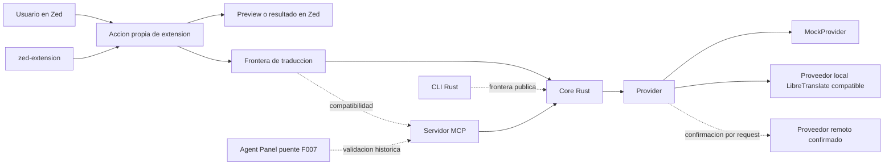
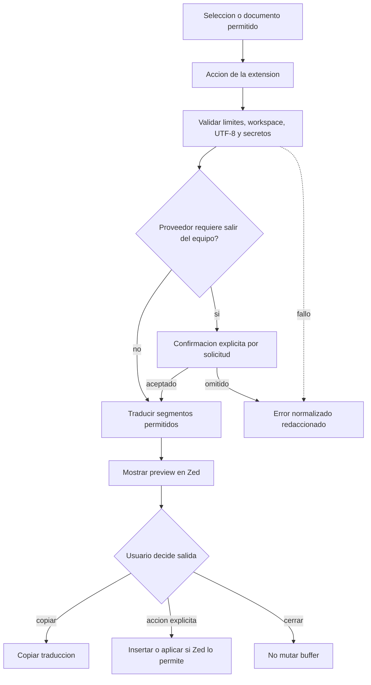
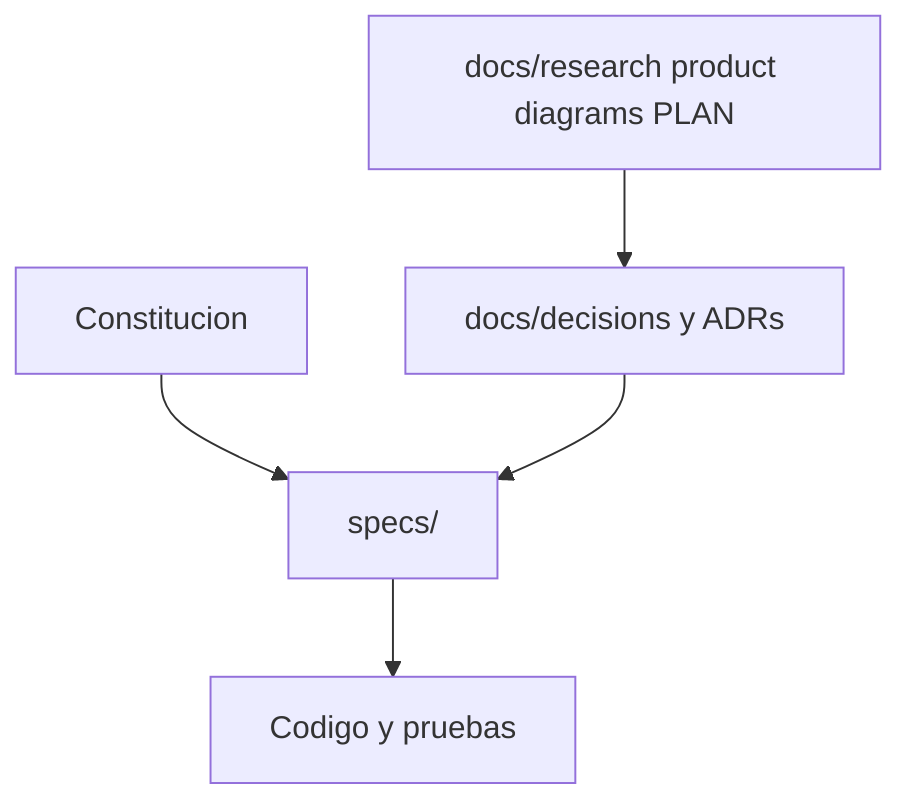
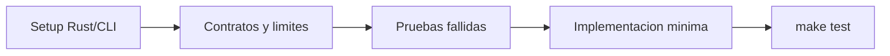
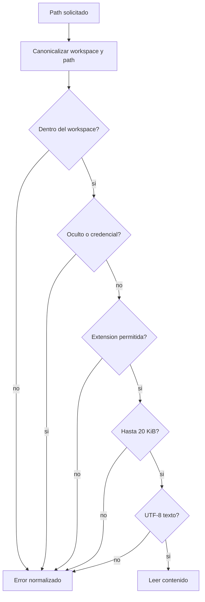
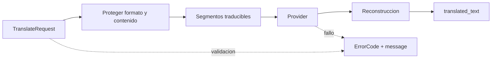

# Diagramas

Diagramas Mermaid fuente para arquitectura y flujos estables. No hay feature
formal activa; la siguiente candidata es F010, flujo directo de extension Zed
sin Agent. Los detalles operativos de una feature activa viven en
`specs/<feature>/`.

## Arquitectura objetivo

## Flujo de producto objetivo

## Frontera de documentacion

## Primer ciclo formal

## Lectura segura de archivo

## Provider por segmentos

