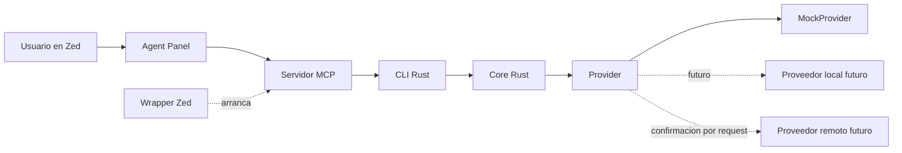
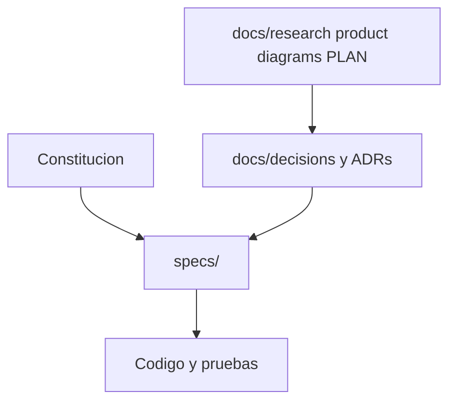
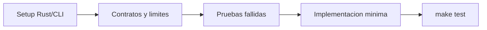
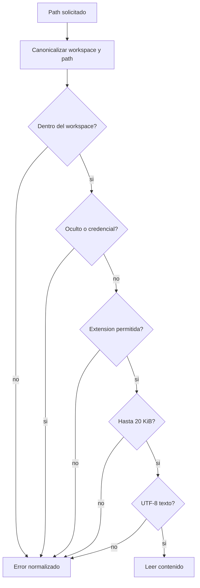
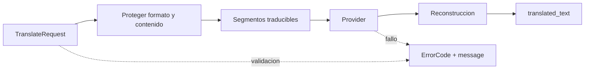

# Diagramas

Diagramas Mermaid fuente para arquitectura y flujos estables. La feature activa
se detalla en `specs/001-translation-core-contract/`.

## Arquitectura objetivo

## Frontera de documentacion

## Primer ciclo formal

## Lectura segura de archivo

## Provider por segmentos

