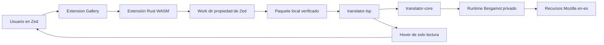
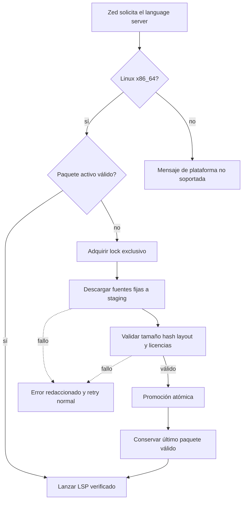
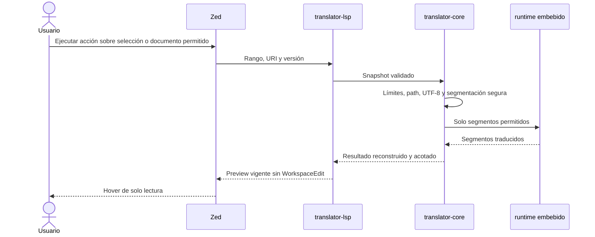
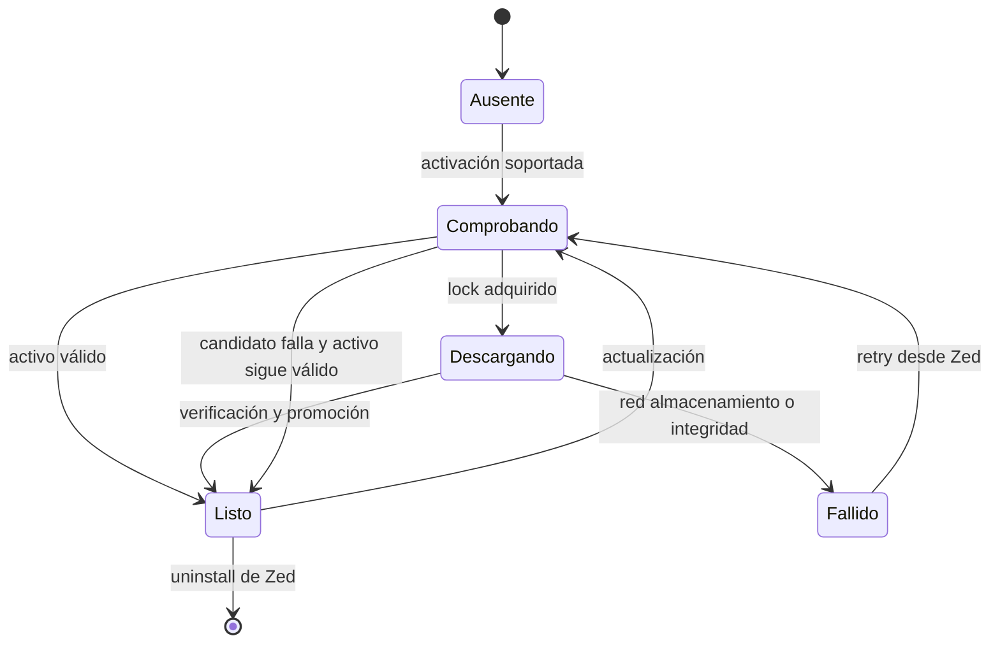
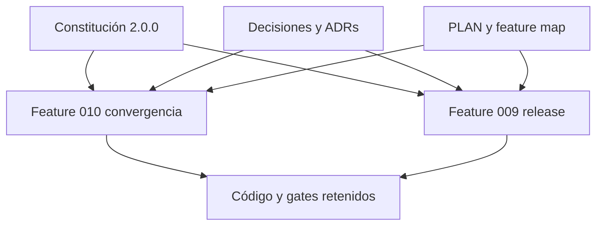

# Diagramas

Diagramas Mermaid de la única arquitectura soportada y sus fronteras estables.

## Arquitectura del producto

Solo la extensión adquiere entradas públicas. LSP, core y runtime no descargan
ni aceptan rutas o motores elegidos por el usuario.

## Preparación del paquete

Staging nunca es ejecutable. Un fallo no desplaza un paquete activo verificado.

## Traducción local

Un cambio o cierre del documento invalida el preview. Ningún paso escribe el
buffer o el archivo fuente.

## Estado local de adquisición

## Autoridad documental

