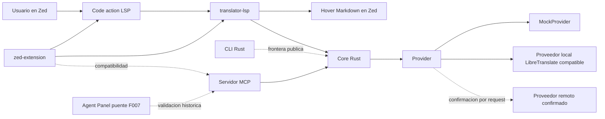
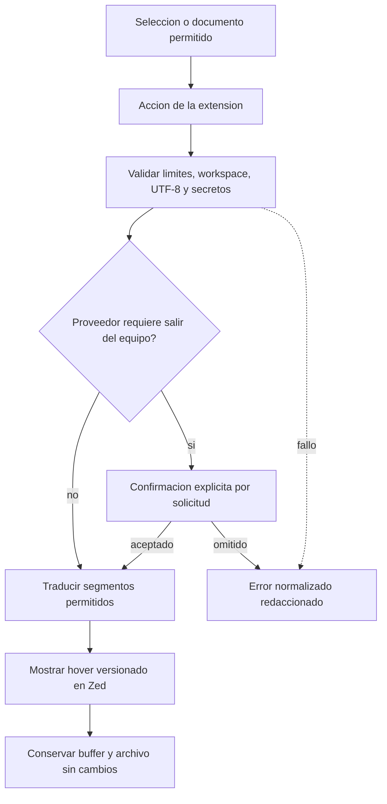
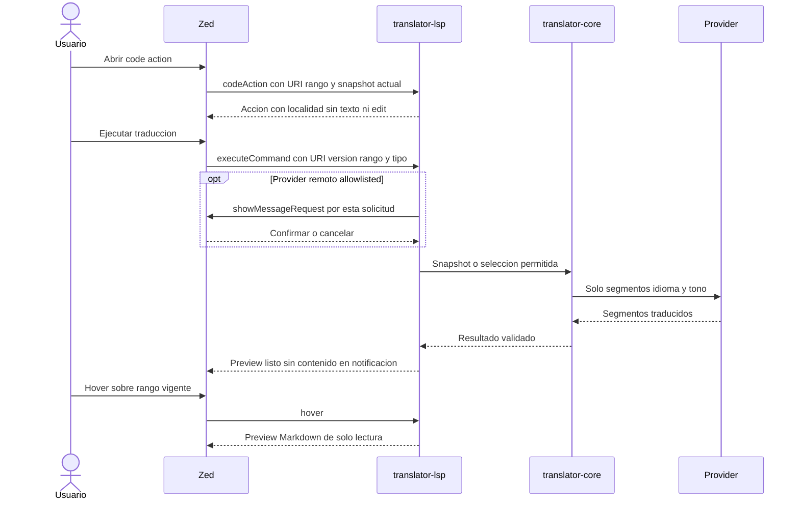
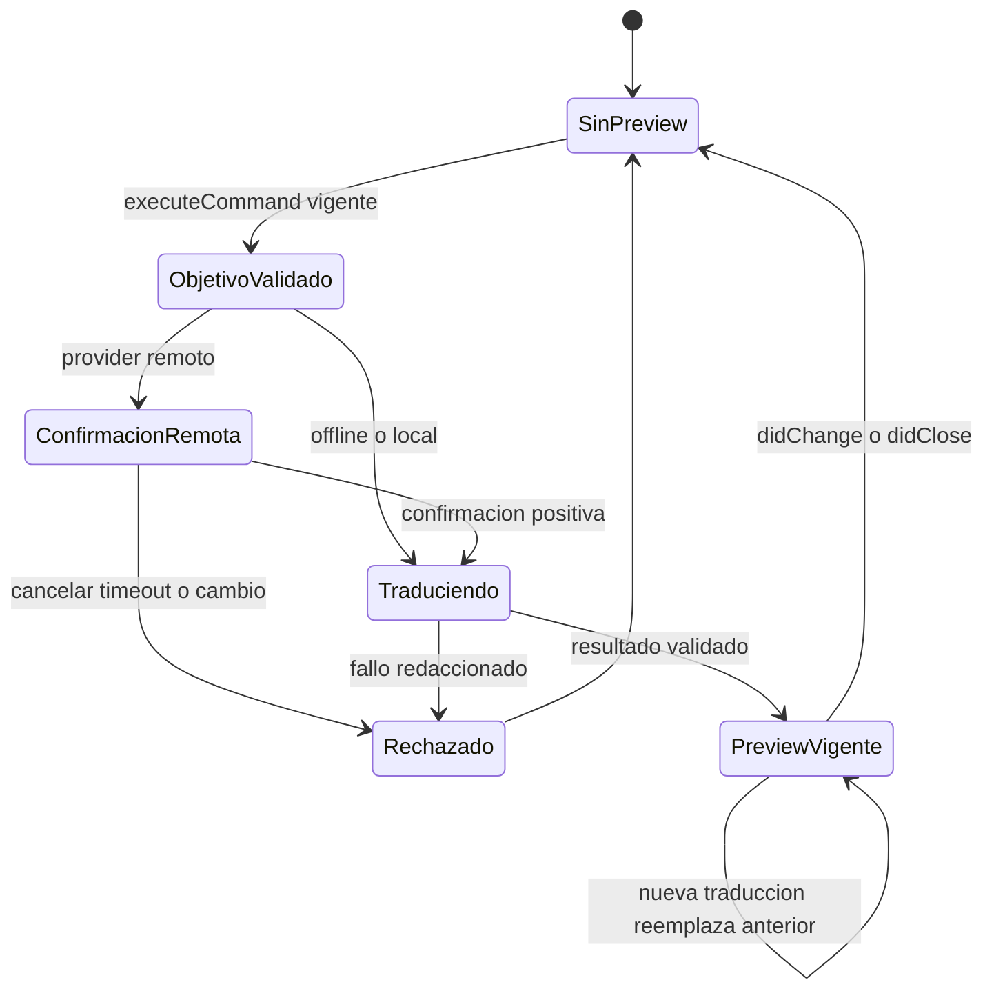
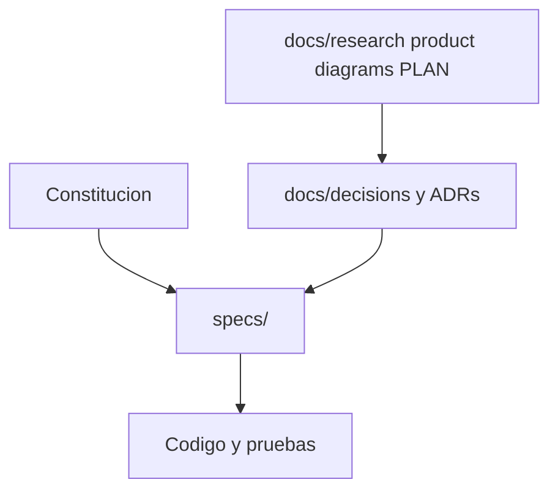
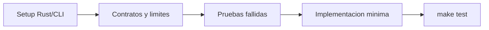
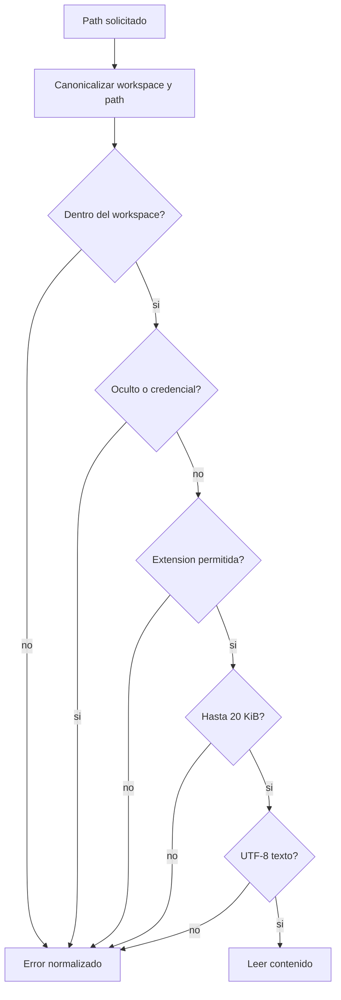
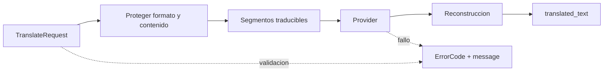

# Diagramas

Diagramas Mermaid fuente para arquitectura y flujos estables. F010 esta
completada en `specs/006-direct-zed-translation/`, incluida su validacion manual
interactiva.

## Arquitectura directa actual

## Flujo de producto objetivo

## Secuencia del flujo directo

## Estado del preview directo

## Frontera de documentacion

## Primer ciclo formal

## Lectura segura de archivo

## Provider por segmentos

